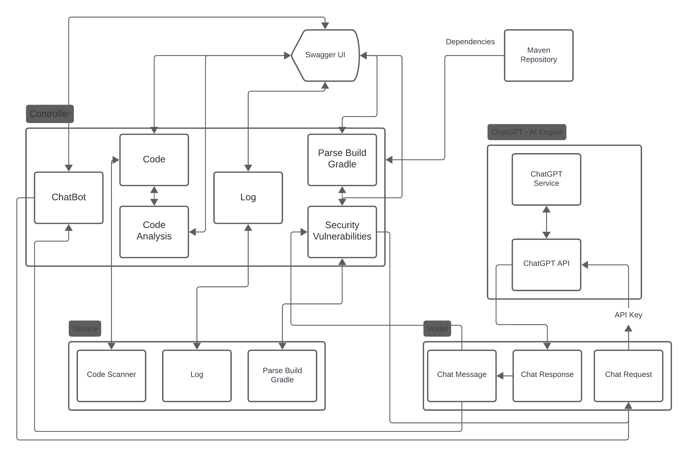

# Verification and Potential Security Issues in Microservices

Microservices represent a distributed architectural pattern utilized for designing and developing services or APIs, facilitating secure communication between clients and servers. Despite the availability of several distributed architectures, microservices stand out for their scalability and loose coupling, enhancing resource management and utilization efficiency. However, as applications expand, various challenges arise that hinder effective communication between different services, potentially exposing vulnerabilities that malicious actors could exploit. This research aims to identify and address security issues inherent in microservices architecture, proposing a model for verifying the architecture's robustness. The primary objective is to develop solutions that mitigate security risks by leveraging verification mechanisms to assess and enhance system integrity.

<h2>Table of contents</h2>

- [Introduction](#introduction)
    - [Architecture Diagram of Spring Boot Application Integrating with ChatGPT Service via API Key](#architecture-diagram-of-spring-boot-application-integrating-with-chatgpt-service-via-api-key)
- [Technologies](#technologies)
- [Project status](#project-status)
- [Installation](#installation)
    - [Get repository](#get-repository)
- [License](#license)

## Introduction
Microservices represent a distributed architectural pattern utilized for designing and developing services or APIs, facilitating secure communication between clients and servers. Despite the availability of several distributed architectures, mi- croservices stand out for their scalability and loose coupling, enhancing resource management and utilization efficiency. How- ever, as applications expand, various challenges arise that hinder effective communication between different services, potentially exposing vulnerabilities that malicious actors could exploit. This research aims to identify and address security issues inherent in microservices architecture, focusing on specific challenges such as authentication, authorization, and data integrity. It proposes a comprehensive model for verifying the architecture’s robustness, leveraging advanced verification mechanisms to assess and enhance system integrity.

Innovatively, this study introduces a novel approach to ad- dressing security concerns within a microservices architecture. By developing a suite of APIs that interact with the ChatGPT Service, the research integrates generative AI techniques to conduct a comprehensive security analysis. These APIs facilitate dynamic analysis of dependencies, perform static code analysis, conduct code reviews, and document code readability, providing a multi-dimensional assessment of the system’s security posture. Moreover, leveraging AI enables not only the identification of vulnerabilities but also the generation of tailored solutions to enhance system resilience. By employing generative AI in the security analysis process, this research pioneers a proactive approach to microservices security, offering actionable insights to fortify distributed systems against emerging threats.

### Architecture Diagram of Spring Boot Application Integrating with ChatGPT Service via API Key



## Technologies
- Spring Boot
- Java
- Gradle
- [ChatGPT API](https://platform.openai.com/docs/api-reference/introduction)

## Project status
**Complete**

## Installation

### Get repository
```git
git https://github.com/msaf9/verification-and-potential-security-issues-in-microservices.git
cd verification-and-potential-security-issues-in-microservices
```

## License
[MIT License](LICENSE)
